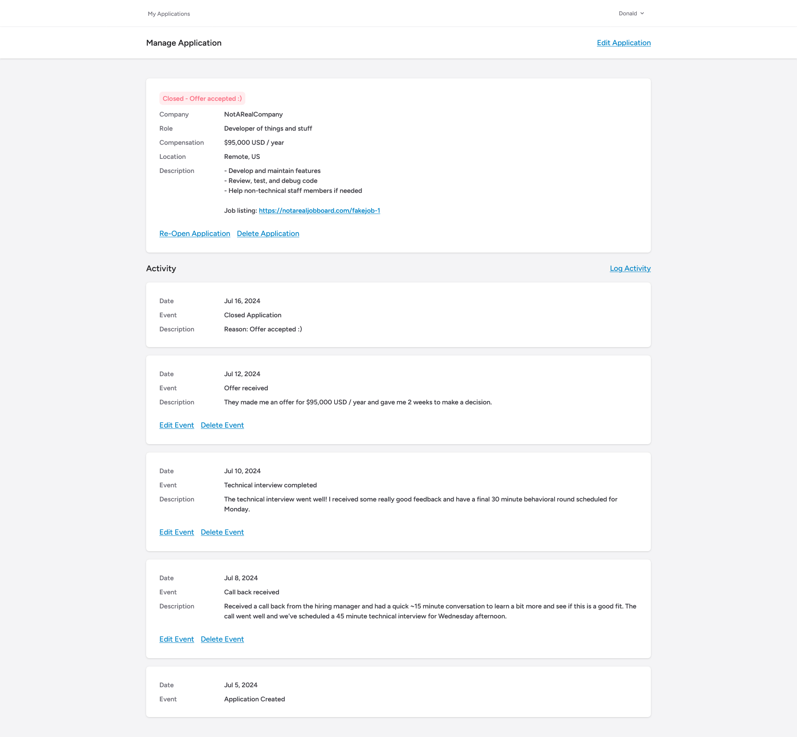

# Introduction

A simple dashboard to track job applications made in Laravel 10 and TailwindCSS. It's self-hosted and single-user, and you can track each stage of the application process with an event timeline.

## Screenshot



## Installation

> This was built on `PHP 8.1.10` and `Laravel ^10.10`

1. Clone the repo

    ```sh
    git clone https://github.com/itsmeslof/job-application-tracker.git
    ```

2. Install Composer packages

    ```sh
    composer install
    ```

3. Install NPM packages

    ```sh
    npm install
    ```

4. Build resources

    ```sh
    npm run build
    ```

5. Configure your `.env` file

6. Run migrations

    ```sh
    php artisan migrate --force
    ```

7. Run the setup command

    ```sh
    php artisan app:setup
    ```

After running the setup command, you can login with the default credentials:

| Email             | Password |
| ----------------- | -------- |
| <admin@example.com> | password |

:warning: **You should change the default credentials immediately**

You can reset the default credentials by running `php artisan app:reset`

## Security Vulnerabilities

If you discover a security vulnerability please send an e-mail to [slof@hey.com](mailto:slof@hey.com). All security vulnerabilities will be promptly addressed.

## License

This project is open-sourced software licensed under the [MIT license](https://opensource.org/licenses/MIT).
